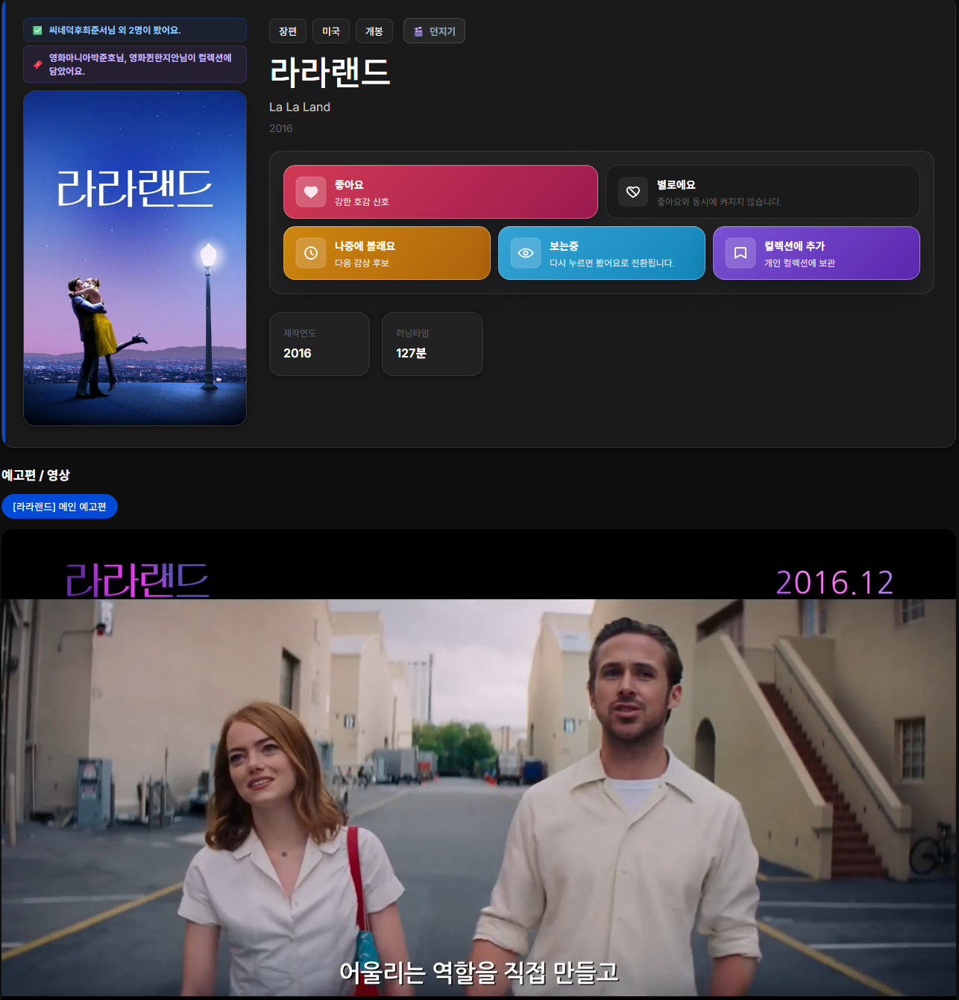
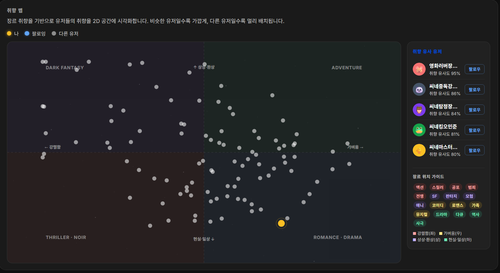
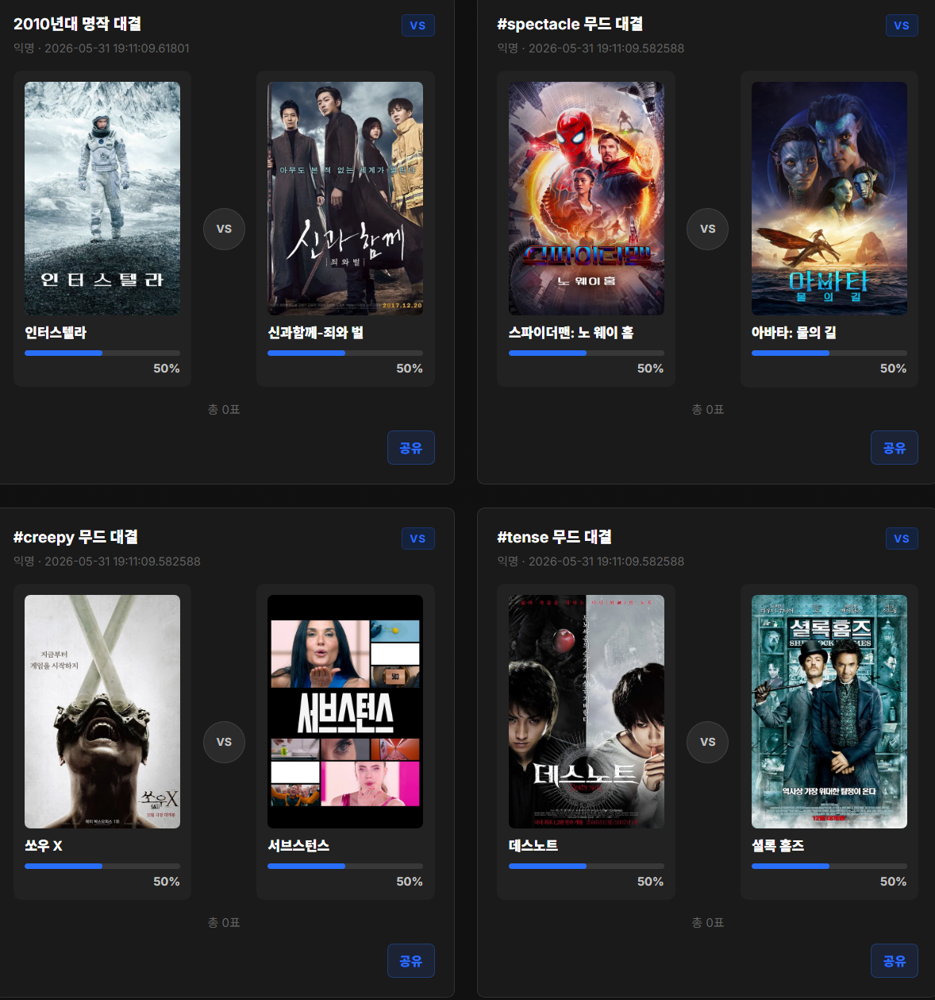
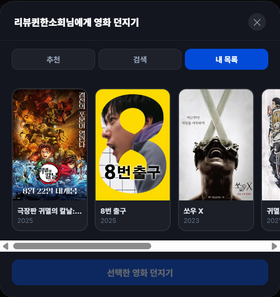
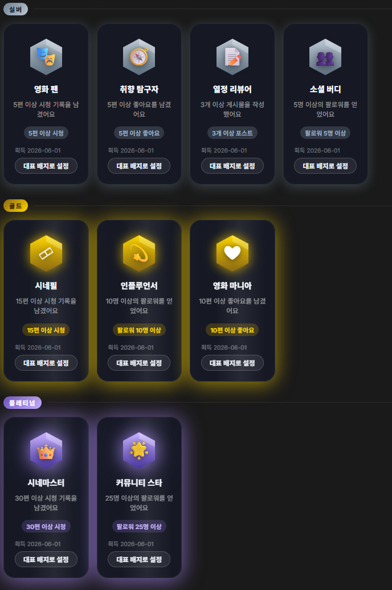
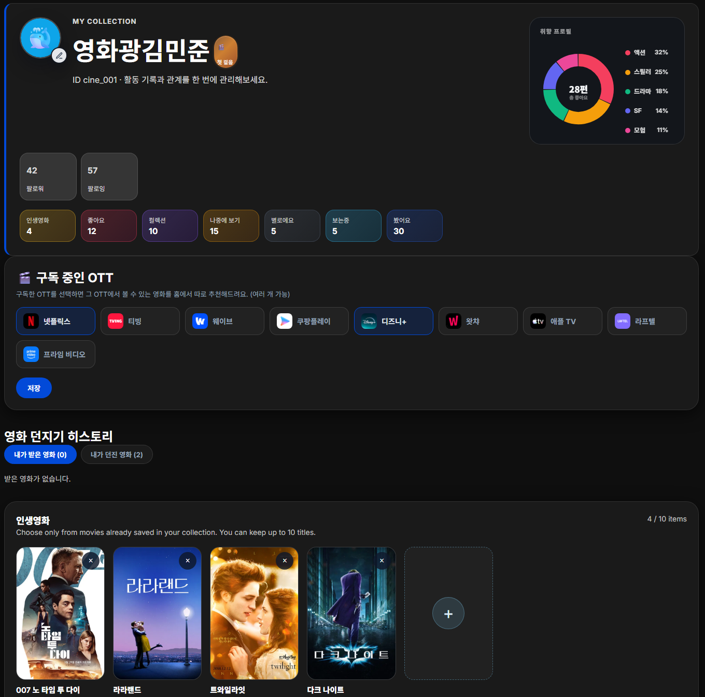

# 🎬 CineMatch

> **"볼 게 너무 많아서 못 고르는 시대"의 영화 큐레이션 서비스**
> OTT는 넘쳐나고 영화는 수만 편. CineMatch는 *무엇을 볼지*를 대신 골라주고, 바로 그 영화를 볼 수 있는 **OTT로 연결**합니다.


-blue)


---

## 📑 목차

1. [기획 배경](#-기획-배경)
2. [한 줄 소개](#-한-줄-소개)
3. [핵심 차별점](#-핵심-차별점)
4. [전체 기능](#-전체-기능)
5. [주요 기능 상세](#-주요-기능-상세)
6. [추천 알고리즘 동작 방식](#-추천-알고리즘-동작-방식)
7. [아키텍처 / 패키지 구조](#-아키텍처--패키지-구조)
8. [데이터 파이프라인](#-데이터-파이프라인)
9. [기술 스택](#-기술-스택)
10. [실행 방법](#-실행-방법)
11. [개발 기록 (타임라인)](#️-개발-기록-타임라인)
12. [팀](#-팀)

---

## 🎯 기획 배경

넷플릭스, 티빙, 웨이브, 디즈니+, 왓챠… **OTT는 늘어났는데 정작 "뭘 볼지" 고르는 건 더 어려워졌습니다.**

- 콘텐츠는 수만 편인데, 추천은 **내가 이미 가입한 플랫폼 안**에서만 돈다.
- "이 영화 어디서 보지?"를 매번 따로 검색해야 한다.
- 친구가 추천해줘도, 그걸 한곳에서 기록하고 같이 이야기할 공간이 없다.

**CineMatch는 이 '선택 장애'를 정면으로 겨냥합니다.**
사용자의 취향을 학습해 영화를 추천하고 → 그 영화를 **실제로 볼 수 있는 OTT/극장 링크로 연결**하며 → 영화를 중심으로 한 **소셜 경험**(리뷰·피드·배틀·영화 던지기)까지 한곳에서 제공합니다.

---

## 💡 한 줄 소개

> **개인화 추천 + OTT 바로가기 + 영화 소셜**을 하나로 묶은 영화 큐레이션 플랫폼.
> 활동할수록 추천이 똑똑해지고, 추천받은 영화는 바로 볼 수 있으며, 그 영화로 사람들과 연결됩니다.

---

## ✨ 핵심 차별점

다른 영화 사이트와 구별되는 CineMatch만의 기능입니다.

| 기능 | 무엇이 다른가 |
|------|----------------|
| 🧠 **개인화 추천 엔진 v4.0** | 단순 평점순이 아니라, 활동을 시간 감쇠·단기/장기 취향으로 나눠 학습하고 협업 필터링·다양성 보정·탐험 추천까지 결합 |
| 📺 **구독 OTT 기반 추천 + 바로가기** | "내가 가입한 OTT에서 볼 수 있는 영화"를 우선 추천하고, 크롤링한 실제 direct URL로 바로 연결 |
| 🗺️ **취향 유사도 맵 (Taste Map)** | 사용자의 영화 취향을 2D 평면에 시각화해, 나와 취향이 가까운 사람을 한눈에 보여줌 |
| ⚔️ **영화 배틀** | 두 영화를 맞붙이는 투표 콘텐츠. 장르·감독·배우·태그·시대 기준으로 자동 생성하거나 직접 만들 수 있음 |
| 🎯 **영화 던지기** | 상호 팔로우한 친구에게 한마디와 함께 영화를 "던져" 추천. 상대가 보면 상태를 추적해 알림 |
| 👥 **협업 추천 (인생영화)** | 나와 취향이 비슷하거나 내가 팔로우한 사용자의 *인생영화*를 홈에 별도 섹션으로 노출 |

---

## 🧩 전체 기능

<details open>
<summary><b>1. 계정 &amp; 온보딩</b></summary>

- 회원가입 / 로그인 / 로그아웃
- **취향 온보딩** — 분위기 태그별 영화 후보를 보여주고 고르게 해 초기 취향을 확보 (cold-start 완화)
- **구독 OTT 선택** — 가입 시 사용 중인 OTT 9종을 등록 → 추천에 즉시 반영
- 닉네임·loginId·프로필 이미지·**기본 동물 아바타**
</details>

<details>
<summary><b>2. 영화 탐색 &amp; 상세</b></summary>

- 홈: 메인 배너 · 실시간 인기작 · 추천 · 인기 영화 섹션
- 영화 검색 / 장르·태그·키워드 기반 고급 검색
- 영화 상세: 기본 정보 · 추천 태그 · 감독/배우 · 이미지 갤러리 · 예고편
- **OTT/극장 보러가기** — provider 로고 + 실제 direct URL
- 해당 영화 관련 게시물 그리드 · 리뷰
</details>

<details>
<summary><b>3. 영화 평가 &amp; 활동 기록</b></summary>

- **7종 평가**: 좋아요 · 별로예요 · 나중에 볼래요 · 보는중 · 봤어요 · 별점 · 컬렉션
- 새로고침 없이 상태 즉시 반영, 홈/랭킹 카드에서 hover 빠른 평가
- 인생영화 추가/삭제
- ➡️ *모든 활동이 추천 알고리즘의 취향 신호로 사용됨*
</details>

<details>
<summary><b>4. 소셜 — 게시물 &amp; 피드</b></summary>

- 특정 영화를 태그한 게시물 작성
- 게시물 유형 6종: **이미지 · 동영상 · 파일 · 투표 · 퀴즈 · 텍스트**
- 다중 이미지 업로드(최대 5장), drag &amp; drop·미리보기
- 전역 피드(`/feed`) · 영화별 피드(`/movies/{code}/posts`) · 무한 스크롤
- 게시물 좋아요 · 댓글 · 투표/퀴즈 참여
</details>

<details>
<summary><b>5. 소셜 — 친구 &amp; 영화 나눔</b></summary>

- 팔로우 / 언팔로우 · 팔로워·팔로잉 목록
- 친구 페이지(`/people`) · 사용자 검색 · **취향 기반 추천 친구**
- 공개 프로필(남의 인생영화·감상·뱃지·팔로우)
- **영화 공유 / 영화 던지기**(상호 팔로우) + 던질 영화 추천 + 상태 추적
</details>

<details>
<summary><b>6. 리뷰</b></summary>

- "봤어요" 영화에 최대 1000자 리뷰
- 1인 1영화 정책(재작성 시 갱신)
- 리뷰 게시판(`/review-board`) · 리뷰 상세 · 좋아요 · 조회수
</details>

<details>
<summary><b>7. 영화 배틀</b></summary>

- 두 영화 맞대결 투표(선택 변경 가능), 득표 수·비율 막대
- **자동 생성 5종**: 장르 · 감독 · 배우 · 태그 · 시대
- 직접 생성(영화/라벨/이미지 지정) · 배틀 댓글·좋아요 · 친구에게 배틀 공유
</details>

<details>
<summary><b>8. 랭킹 &amp; 차트</b></summary>

- **15종 테마 차트**: 역대 매출 · 천만 클럽 · 세계 흥행 · 평점 명작 · 가성비 · 반짝 흥행 · 장르별 1위 · 배우/감독 대표작 · 실시간 인기 등
</details>

<details>
<summary><b>9. 마이페이지 · 뱃지 · 알림</b></summary>

- 활동 요약(좋아요·봤어요·컬렉션·인생영화 등) · 프로필/구독 OTT 관리
- **취향 시각화(Taste Map)**
- **뱃지/업적** — 13종, 4티어(브론즈·실버·골드·플래티넘), 진행도 표시, 대표 뱃지 선택
- 알림 센터 — 팔로우·게시물 좋아요/댓글·리뷰 좋아요·영화 공유/던지기·상태 변화
</details>

<details>
<summary><b>공통 UI</b></summary>

- 상단바(알림·로그인) + 좌측 사이드바(홈·랭킹·피드·리뷰·친구·배틀·프로필)
- 현재 메뉴 active 강조, 공통 app-shell 레이아웃
</details>

---

## 📖 주요 기능 상세

CineMatch에서 특히 공들인 핵심 기능들을 화면과 함께 하나씩 자세히 소개합니다.

### 🎬 영화 상세 — 추천에서 시청까지

추천이 "추천으로만" 끝나지 않도록, 영화 상세 **한 화면에서 정보 확인 → 평가 → 실제 시청 연결**까지 이어집니다.

- 포스터·줄거리·개봉연도·러닝타임·감독/배우 등 기본 정보와 **추천 분위기 태그**
- **7종 평가**(좋아요·별로예요·나중에 볼래요·보는중·봤어요·별점·컬렉션)를 새로고침 없이 즉시 반영 — 모든 평가가 추천 신호로 사용됨
- 이미지 갤러리와 **예고편** 재생
- **OTT/극장 보러가기** — 크롤링한 실제 direct URL로 바로 연결해 "이거 어디서 보지?"를 해소

<p align="center"></p>

### 🗺️ 취향 유사도 맵 (Taste Map)

사용자의 영화 취향을 **2차원 평면**에 배치해, 나와 취향이 가까운 사람을 직관적으로 보여줍니다.

<p align="center"></p>

- 평면 위 점은 **나(노랑) · 팔로잉(파랑) · 다른 유저(회색)** 로 구분되고, 가까울수록 취향이 비슷합니다.
- 우측에 **취향 유사 유저**를 유사도 %와 함께 보여주고, 바로 팔로우할 수 있습니다.
- **X축**: 강렬함(액션·스릴러·공포) ↔ 가벼움(코미디·로맨스·가족) / **Y축**: 상상·환상(SF·판타지·모험) ↔ 현실·일상(다큐·역사·드라마)

```
계산 과정
1) 활동 가중치로 장르 점수 집계  (인생영화 ×5 / 좋아요 ×3 / 시청 ×1)
2) 장르별 (X,Y) 가중치를 곱해 사용자 좌표 산출
3) 표준편차(±2σ) 기반 정규화 → 중앙 과밀 방지
4) 평면에 사용자들을 배치 + '나'와 '팔로우' 강조
```

→ 가까이 있을수록 취향이 비슷하다는 뜻이라, **취향 기반 친구 추천**과 자연스럽게 연결됩니다.

### ⚔️ 영화 배틀

두 영화를 맞붙여 투표하는 콘텐츠로, 가볍게 즐기면서 자연스럽게 취향을 드러낼 수 있습니다.

- 한쪽을 고르면 실시간으로 **득표 수·비율(%)** 이 갱신되고, 선택 변경·취소 가능
- **자동 생성 5종** — 같은 장르·감독·배우·무드 태그·시대 기준으로 비슷한 작품끼리 매칭
- 직접 배틀 생성(영화·라벨·이미지 지정), 배틀별 댓글·좋아요, 친구에게 배틀 공유

<p align="center"></p>

### 🎯 영화 던지기

"이거 꼭 봐!"를 행동으로 옮기는, CineMatch만의 소셜 추천 방식입니다.

- **상호 팔로우**한 친구에게 한마디와 함께 영화를 "던져" 추천
- 던질 영화를 **추천·검색·내 목록** 탭에서 골라 전달
- 상대가 그 영화를 봤는지 **상태를 추적**하고 알림으로 연결

<p align="center"></p>

### 🏅 뱃지 · 업적

활동을 꾸준히 이어가도록 동기를 주는 업적 시스템입니다.

- **13종 · 4티어**(브론즈·실버·골드·플래티넘) — 시청·좋아요·리뷰·팔로우 등 활동으로 자동 획득
- 각 뱃지의 **획득 조건과 진행도** 표시
- 보유한 뱃지 중 **대표 뱃지**를 골라 프로필·피드의 이름 옆에 노출

<p align="center"></p>

### 👤 마이페이지 · 프로필

나의 영화 활동을 한곳에서 관리하고 취향을 돌아볼 수 있는 공간입니다.

- 좋아요·봤어요·컬렉션·인생영화 등 **활동 요약** 카드
- **취향 도넛 차트**로 내 장르 분포를 한눈에 시각화
- **구독 중인 OTT** 관리 → 그 OTT에서 볼 수 있는 영화를 홈에서 우선 추천
- 인생영화 리스트 관리

<p align="center"></p>

---

## 🧠 추천 알고리즘 동작 방식

> 알고리즘 버전: **`content-ranking-v4.0`** — 콘텐츠 기반 랭킹을 중심으로 협업 필터링과 다양성 제어를 결합한 하이브리드 방식.

```
사용자 활동(좋아요·별점·봤어요·인생영화 …)
        │
        ▼
① 취향 프로필 생성  ──  feature 7종(tag·genre·director·actor·provider …)을 벡터로 변환
        │              · 시간 감쇠(λ=0.005): 최근 활동일수록 가중치 ↑
        │              · 단기 취향(최근 15건) 65% + 장기 취향 35% 블렌딩
        ▼
② 긍정/부정 신호    ──  좋아요·고별점 = 양(+), 별로예요·저별점 = 음(−)
        │              (별점 1★ 부정 ~ 5★ 강한 긍정)
        ▼
③ 후보 랭킹 점수    ──  콘텐츠 유사도 + 아이템 기반 CF(movie_co_occurrence)
        │              + 구독 OTT 부스트 + 신선도 + 인기도 필터(popularity ≥ 2.0)
        ▼
④ 다양성/탐험 보정  ──  같은 장르·감독·태그 과점 방지 재정렬
        │              + Serendipity 블록(취향 경계의 새 장르/태그 1개 노출)
        ▼
⑤ 추천 블록 구성    ──  tag / genre / director / actor / provider / OTT 블록으로 분류
        │
        ▼
⑥ 지연 재계산       ──  활동 변경 시 dirty 표시 → 다음 요청 때만 다시 계산
```

**핵심 아이디어**
- 단순 "평점 높은 순"이 아니라, **사용자가 남긴 활동 자체를 취향 벡터로 학습**합니다.
- **최근에 한 행동**을 더 크게 반영(시간 감쇠 + 단기 취향 레이어)해 취향 변화를 빠르게 따라갑니다.
- 비슷한 사람들이 함께 본 영화를 섞는 **협업 필터링**과, 취향 밖 영화를 일부러 끼워 넣는 **탐험 추천**으로 추천이 한쪽으로 쏠리지 않게 합니다.
- 내가 **구독한 OTT에서 볼 수 있는 영화**에 가산점을 줘, "추천은 했는데 볼 수가 없는" 문제를 줄입니다.

---

## 🏗️ 아키텍처 / 패키지 구조

```
com.cinematch
├── recommendation/   # 개인화 추천 엔진 v4.0 (취향 프로필 · 랭킹 · 블록 · 협업 추천 · refresh)
├── chart/            # 테마 랭킹 차트 15종 (ChartAlgorithm → AbstractJdbcChartAlgorithm)
├── tag/              # 영화 분위기 태그 29종 자동 생성
├── ott/              # OTT 시청 링크 매핑 · 구독 관리 · provider 카탈로그(9종)
├── battle/           # 영화 배틀 (생성·투표·댓글·공유)
├── tastemap/         # 취향 유사도 맵 (2D 시각화)
├── notification/     # 소셜 알림
├── kobis/            # KOBIS 수집·정규화·박스오피스
├── tmdb/             # TMDB 수집·정규화·트렌딩
├── youtube/          # YouTube 예고편 검색·보강
├── admin/            # 데이터 파이프라인 배치 · 더미 시드
└── (root)            # MovieController · PostController · ReviewController · BadgeService
                      # MovieThrow* · LoginApplication(부트스트랩)
```

- **DB 스키마**: `src/main/resources/schema.sql` — 앱 시작 시 `SchemaBootstrapRunner`가 자동 적용
- **추천 가중치 집중지**: `recommendation/RecommendationFeaturePolicy`

---

## 🔗 데이터 파이프라인

```
KOBIS API ──┐
            ├─→ 정규화 ─→ movie (DB) ─→ 태그 생성(29종) ─→ 추천 엔진
TMDB API ───┘                                 │
                                              ├─ Kinolights 크롤링 → OTT/극장 direct URL
                                              └─ YouTube Data API → 예고편 보강
```

- **KOBIS**: 국내 영화 골격(제목·장르·감독·배우·박스오피스)
- **TMDB**: 포스터·줄거리·평점·인기도·키워드·이미지·트렌딩 보강
- **Kinolights 크롤링(jsoup)**: 영화별 OTT/극장 "보러가기" direct URL 수집 → `movie_ott_link` 캐시, 크롤 상태(`SUCCESS`/`NO_LINK`/`NO_TITLE`/`FAILED`) 관리로 중복 크롤링 방지
- **YouTube Data API v3**: 예고편 없는 영화에 트레일러 자동 보강
- **자동 태깅**: 장르·키워드·러닝타임 규칙으로 분위기 태그 29종(MOOD/CONTEXT/THEME/CAUTION)을 0~100 점수로 부여

---

## 🛠️ 기술 스택

| 구분 | 사용 기술 |
|------|-----------|
| **Language** | Java 25 |
| **Framework** | Spring Boot 4.0.4 (Web, JDBC, Thymeleaf) |
| **DB** | H2 (file, `MODE=MySQL`) — `spring-boot-starter-jdbc`의 `JdbcTemplate` 직접 사용 (ORM 미사용) |
| **View** | Thymeleaf + 공통 app-shell (HTML/CSS/JS) |
| **Crawling / Parsing** | jsoup, commons-csv |
| **External API** | KOBIS Open API · TMDB API · YouTube Data API v3 |
| **Build** | Maven (`mvnw`) |

---

## 🚀 실행 방법

### 사전 준비 (환경변수)

| 변수 | 설명 |
|------|------|
| `KOBIS_API_KEY` | 영화진흥위원회 Open API 키 |
| `TMDB_TOKEN` | TMDB Bearer Token |

> API 키 없이도 H2 파일 DB에 적재된 데이터로 화면 동작은 확인할 수 있습니다.

### 빌드 & 실행

```bash
# 빌드
./mvnw.cmd clean package -DskipTests

# 로컬 실행 (H2 파일 DB)
./mvnw.cmd spring-boot:run

# 전체 테스트
./mvnw.cmd test
```

- 접속: `http://localhost:8080`
- H2 콘솔: `http://localhost:8080/h2-console`
  (JDBC URL: `jdbc:h2:file:./data/kobisdb;MODE=MySQL`)

### 테스트 계정

| 계정 | 비밀번호 |
|------|----------|
| `testuser01` ~ `testuser16` | `Test1234!` |

---

## 🗓️ 개발 기록 (타임라인)

이 프로젝트는 기획 초기부터 최종 발표까지의 작업을 **날짜순 시간 흐름**으로 기록해 왔습니다.(기획 + 초기구현 단계는 날짜는 미기록 되어있습니다.)
4월 말 차트·추천 기반을 세우는 것에서 시작해 → 5월 UI/UX 인터랙션과 소셜 기능을 확장하고 → 6월 OTT 구독 기반 추천·회원가입·소셜 고도화로 발표를 마무리하기까지, 각 시점의 구현 사항과 변경 파일을 날짜별로 정리했습니다.

| 시기 | 주요 작업 |
|------|-----------|
| **04-30** | 차트 알고리즘 확장 · 랭킹 UI 개편 (프로젝트 기반 구축) |
| **05-04 ~ 05-08** | 리뷰·게시물·알림 등 소셜 토대 · 마이페이지 개편 · 실시간 인기작(TMDB) |
| **05-15 ~ 05-18** | 전역 피드 · 영화 던지기 · UI/UX 인터랙션 다듬기 |
| **05-26 ~ 05-28** | 영화 배틀 · 영화 상세(갤러리·예고편) · OTT 보러가기 링크 크롤링 |
| **06-07** | OTT 구독 기반 추천 · 회원가입 · 소셜 기능 고도화 (발표 마무리) |

> 위 문서가 *무엇을* 만들었는지(기능·구조·알고리즘)를 설명한다면, 개발 기록은 *언제·어떻게* 만들어 왔는지(시간 흐름)를 보여줍니다.

👉 **[개발 기록 전체 보기 → `README_HISTORY.md`](./README_HISTORY.md)** — 날짜별 구현 사항·변경 파일·프로젝트 전체 설명

---

## 👥 팀

**2026 문제해결프로그래밍설계 — AJ Team 2**

<!-- 팀원 정보를 채워주세요 (행을 추가/삭제하세요) -->
| 이름 | 학번 |
|------|------|
| 김경현 | 32200338 |
| 김현석 | 32201253 |
| 한우진 |  |

---

<div align="center">

**CineMatch** — *고민하는 시간보다, 영화 보는 시간을 더 길게.* 🍿

</div>
